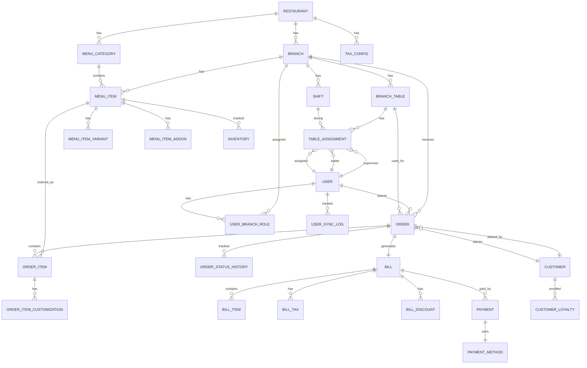

# Restaurant Management System - Database Design

## Table of Contents

1. [Overview](#overview)
2. [Enhanced Requirements](#enhanced-requirements)
3. [Entity Relationship Diagram](#entity-relationship-diagram)
4. [Database Schema](#database-schema)
5. [Table Definitions](#table-definitions)
6. [Relationships and Constraints](#relationships-and-constraints)
7. [Indexes](#indexes)
8. [Data Synchronization Strategy](#data-synchronization-strategy)
9. [Best Practices and Enhancements](#best-practices-and-enhancements)

---

## Overview

This document provides a comprehensive database design for a multi-tenant Restaurant Management System (RMS) that supports:

- Multi-branch restaurant operations
- Role-based user management with Keycloak/Gateway synchronization
- Table management with dynamic waiter/supervisor assignments
- Comprehensive menu management (food and beverages)
- Online and offline ordering
- POS system with billing and tax management
- Multiple payment methods

**Technology Stack:**

- Database: PostgreSQL
- Framework: Spring Boot 3.4.5 with R2DBC (Reactive)
- Multi-tenancy: Separate database per tenant

---

## Enhanced Requirements

### Core Requirements (From User)

1. **Restaurant & Branches**: Multi-branch support
2. **Users & Roles**: ROLE_ADMIN, ROLE_MANAGER, ROLE_SUPERVISOR, ROLE_WAITER, ROLE_CASHIER, ROLE_CHEF, ROLE_CUSTOMER, ROLE_ANONYMOUS
3. **User Synchronization**: Sync with Gateway/Keycloak
4. **Tables**: Branch tables with identifiers, mapped to supervisors and waiters (daily changes)
5. **Menu**: Eatables and beverages with cuisine types, veg/non-veg, alcoholic/non-alcoholic
6. **Ordering**: Online (mobile app) and offline (customer/waiter at table)
7. **POS**: Bill generation with tax information
8. **Payments**: Cash, card, GPay, etc.

### Enhanced Requirements (Best Practices)

1. **Audit Trail**: Track all changes with timestamps and user information
2. **Soft Deletes**: Preserve data for historical analysis
3. **Status Management**: Order status workflow, table status, payment status
4. **Inventory Management**: Track stock levels for menu items
5. **Tax Configuration**: Flexible tax rates (GST, VAT, service tax, etc.)
6. **Discounts & Promotions**: Support for various discount types
7. **Order Modifications**: Handle order changes, cancellations, refunds
8. **Payment Reconciliation**: Track payment status and reconciliation
9. **Table Availability**: Real-time table status tracking
10. **Menu Variants**: Size, spice level, add-ons, customizations
11. **Customer Management**: Customer profiles, loyalty programs
12. **Shift Management**: Track employee shifts and assignments
13. **Reporting**: Support for analytics and reporting queries

---

## Entity Relationship Diagram



---

## Database Schema

### Core Entities

#### 1. RESTAURANT

**Purpose**: Top-level entity representing a restaurant chain/brand

| Column        | Type         | Constraints      | Description                     |
| ------------- | ------------ | ---------------- | ------------------------------- |
| id            | UUID         | PK               | Primary key                     |
| name          | VARCHAR(255) | NOT NULL         | Restaurant name                 |
| code          | VARCHAR(50)  | UNIQUE, NOT NULL | Unique restaurant code          |
| description   | TEXT         |                  | Restaurant description          |
| logo_url      | VARCHAR(500) |                  | Logo image URL                  |
| contact_email | VARCHAR(255) |                  | Contact email                   |
| contact_phone | VARCHAR(20)  |                  | Contact phone                   |
| address_line1 | VARCHAR(255) |                  | Address line 1                  |
| address_line2 | VARCHAR(255) |                  | Address line 2                  |
| city          | VARCHAR(100) |                  | City                            |
| state         | VARCHAR(100) |                  | State/Province                  |
| country       | VARCHAR(100) |                  | Country                         |
| postal_code   | VARCHAR(20)  |                  | Postal/ZIP code                 |
| timezone      | VARCHAR(50)  |                  | Timezone (e.g., 'Asia/Kolkata') |
| is_active     | BOOLEAN      | DEFAULT true     | Active status                   |
| created_at    | TIMESTAMP    | NOT NULL         | Creation timestamp              |
| created_by    | VARCHAR(255) |                  | Creator user ID                 |
| updated_at    | TIMESTAMP    | NOT NULL         | Last update timestamp           |
| updated_by    | VARCHAR(255) |                  | Last updater user ID            |
| version       | INTEGER      | DEFAULT 0        | Optimistic locking version      |

**Indexes:**

- `idx_restaurant_code` on `code`
- `idx_restaurant_active` on `is_active`

---

#### 2. BRANCH

**Purpose**: Represents a physical location/branch of a restaurant

| Column        | Type          | Constraints        | Description                            |
| ------------- | ------------- | ------------------ | -------------------------------------- |
| id            | UUID          | PK                 | Primary key                            |
| restaurant_id | UUID          | FK → RESTAURANT.id | Parent restaurant                      |
| name          | VARCHAR(255)  | NOT NULL           | Branch name                            |
| code          | VARCHAR(50)   | NOT NULL           | Unique branch code (within restaurant) |
| description   | TEXT          |                    | Branch description                     |
| contact_email | VARCHAR(255)  |                    | Contact email                          |
| contact_phone | VARCHAR(20)   |                    | Contact phone                          |
| address_line1 | VARCHAR(255)  |                    | Address line 1                         |
| address_line2 | VARCHAR(255)  |                    | Address line 2                         |
| city          | VARCHAR(100)  |                    | City                                   |
| state         | VARCHAR(100)  |                    | State/Province                         |
| country       | VARCHAR(100)  |                    | Country                                |
| postal_code   | VARCHAR(20)   |                    | Postal/ZIP code                        |
| latitude      | DECIMAL(10,8) |                    | GPS latitude                           |
| longitude     | DECIMAL(11,8) |                    | GPS longitude                          |
| opening_time  | TIME          |                    | Daily opening time                     |
| closing_time  | TIME          |                    | Daily closing time                     |
| timezone      | VARCHAR(50)   |                    | Timezone                               |
| max_capacity  | INTEGER       |                    | Maximum seating capacity               |
| is_active     | BOOLEAN       | DEFAULT true       | Active status                          |
| created_at    | TIMESTAMP     | NOT NULL           | Creation timestamp                     |
| created_by    | VARCHAR(255)  |                    | Creator user ID                        |
| updated_at    | TIMESTAMP     | NOT NULL           | Last update timestamp                  |
| updated_by    | VARCHAR(255)  |                    | Last updater user ID                   |
| version       | INTEGER       | DEFAULT 0          | Optimistic locking version             |

**Indexes:**

- `idx_branch_restaurant` on `restaurant_id`
- `idx_branch_code` on `restaurant_id, code` (unique)
- `idx_branch_active` on `is_active`

**Unique Constraint:**

- `uk_branch_restaurant_code` on `restaurant_id, code`

---

#### 3. USER

**Purpose**: Represents users synchronized from Gateway/Keycloak

| Column            | Type         | Constraints       | Description                           |
| ----------------- | ------------ | ----------------- | ------------------------------------- |
| id                | UUID         | PK                | Primary key                           |
| external_user_id  | VARCHAR(255) | UNIQUE, NOT NULL  | User ID from Gateway/Keycloak         |
| username          | VARCHAR(100) | UNIQUE, NOT NULL  | Username                              |
| email             | VARCHAR(255) | UNIQUE            | Email address                         |
| phone             | VARCHAR(20)  |                   | Phone number                          |
| first_name        | VARCHAR(100) |                   | First name                            |
| last_name         | VARCHAR(100) |                   | Last name                             |
| display_name      | VARCHAR(255) |                   | Display name                          |
| profile_image_url | VARCHAR(500) |                   | Profile image URL                     |
| is_active         | BOOLEAN      | DEFAULT true      | Active status                         |
| last_sync_at      | TIMESTAMP    |                   | Last synchronization timestamp        |
| sync_status       | VARCHAR(50)  | DEFAULT 'PENDING' | Sync status (PENDING, SYNCED, FAILED) |
| sync_error        | TEXT         |                   | Last sync error message               |
| created_at        | TIMESTAMP    | NOT NULL          | Creation timestamp                    |
| updated_at        | TIMESTAMP    | NOT NULL          | Last update timestamp                 |
| version           | INTEGER      | DEFAULT 0         | Optimistic locking version            |

**Indexes:**

- `idx_user_external_id` on `external_user_id`
- `idx_user_username` on `username`
- `idx_user_email` on `email`
- `idx_user_sync_status` on `sync_status`

---

#### 4. USER_BRANCH_ROLE

**Purpose**: Maps users to branches with specific roles (many-to-many relationship)

| Column      | Type         | Constraints    | Description                           |
| ----------- | ------------ | -------------- | ------------------------------------- |
| id          | UUID         | PK             | Primary key                           |
| user_id     | UUID         | FK → USER.id   | User reference                        |
| branch_id   | UUID         | FK → BRANCH.id | Branch reference                      |
| role        | VARCHAR(50)  | NOT NULL       | Role (ROLE_ADMIN, ROLE_MANAGER, etc.) |
| is_active   | BOOLEAN      | DEFAULT true   | Active status                         |
| assigned_at | TIMESTAMP    | NOT NULL       | Assignment timestamp                  |
| assigned_by | VARCHAR(255) |                | User who assigned                     |
| revoked_at  | TIMESTAMP    |                | Revocation timestamp                  |
| revoked_by  | VARCHAR(255) |                | User who revoked                      |
| created_at  | TIMESTAMP    | NOT NULL       | Creation timestamp                    |
| updated_at  | TIMESTAMP    | NOT NULL       | Last update timestamp                 |

**Indexes:**

- `idx_user_branch_role_user` on `user_id`
- `idx_user_branch_role_branch` on `branch_id`
- `idx_user_branch_role_active` on `user_id, branch_id, is_active`
- `idx_user_branch_role_role` on `role`

**Unique Constraint:**

- `uk_user_branch_role` on `user_id, branch_id, role` (where is_active = true)

---

#### 5. USER_SYNC_LOG

**Purpose**: Tracks synchronization events with Gateway/Keycloak

| Column           | Type         | Constraints  | Description                        |
| ---------------- | ------------ | ------------ | ---------------------------------- |
| id               | UUID         | PK           | Primary key                        |
| user_id          | UUID         | FK → USER.id | User reference                     |
| sync_type        | VARCHAR(50)  | NOT NULL     | Sync type (CREATE, UPDATE, DELETE) |
| sync_status      | VARCHAR(50)  | NOT NULL     | Status (SUCCESS, FAILED)           |
| external_user_id | VARCHAR(255) |              | External user ID                   |
| request_payload  | JSONB        |              | Request payload sent to Gateway    |
| response_payload | JSONB        |              | Response from Gateway              |
| error_message    | TEXT         |              | Error message if failed            |
| synced_at        | TIMESTAMP    | NOT NULL     | Sync timestamp                     |
| synced_by        | VARCHAR(255) |              | System/user who triggered sync     |

**Indexes:**

- `idx_user_sync_log_user` on `user_id`
- `idx_user_sync_log_status` on `sync_status`
- `idx_user_sync_log_type` on `sync_type`
- `idx_user_sync_log_date` on `synced_at`

---

#### 6. BRANCH_TABLE

**Purpose**: Represents physical tables in a branch

| Column       | Type         | Constraints         | Description                                            |
| ------------ | ------------ | ------------------- | ------------------------------------------------------ |
| id           | UUID         | PK                  | Primary key                                            |
| branch_id    | UUID         | FK → BRANCH.id      | Branch reference                                       |
| table_number | VARCHAR(50)  | NOT NULL            | Table identifier/number                                |
| table_name   | VARCHAR(255) |                     | Display name                                           |
| capacity     | INTEGER      | NOT NULL            | Seating capacity                                       |
| floor        | VARCHAR(50)  |                     | Floor number/name                                      |
| section      | VARCHAR(100) |                     | Section/area name                                      |
| status       | VARCHAR(50)  | DEFAULT 'AVAILABLE' | Status (AVAILABLE, OCCUPIED, RESERVED, OUT_OF_SERVICE) |
| qr_code      | VARCHAR(500) |                     | QR code for table                                      |
| qr_code_url  | VARCHAR(500) |                     | QR code image URL                                      |
| is_active    | BOOLEAN      | DEFAULT true        | Active status                                          |
| created_at   | TIMESTAMP    | NOT NULL            | Creation timestamp                                     |
| created_by   | VARCHAR(255) |                     | Creator user ID                                        |
| updated_at   | TIMESTAMP    | NOT NULL            | Last update timestamp                                  |
| updated_by   | VARCHAR(255) |                     | Last updater user ID                                   |
| version      | INTEGER      | DEFAULT 0           | Optimistic locking version                             |

**Indexes:**

- `idx_branch_table_branch` on `branch_id`
- `idx_branch_table_number` on `branch_id, table_number` (unique)
- `idx_branch_table_status` on `status`
- `idx_branch_table_active` on `is_active`

**Unique Constraint:**

- `uk_branch_table_number` on `branch_id, table_number`

---

#### 7. SHIFT

**Purpose**: Represents work shifts for employees

| Column     | Type         | Constraints    | Description                             |
| ---------- | ------------ | -------------- | --------------------------------------- |
| id         | UUID         | PK             | Primary key                             |
| branch_id  | UUID         | FK → BRANCH.id | Branch reference                        |
| shift_name | VARCHAR(100) | NOT NULL       | Shift name (e.g., 'Morning', 'Evening') |
| start_time | TIME         | NOT NULL       | Shift start time                        |
| end_time   | TIME         | NOT NULL       | Shift end time                          |
| shift_date | DATE         | NOT NULL       | Shift date                              |
| is_active  | BOOLEAN      | DEFAULT true   | Active status                           |
| created_at | TIMESTAMP    | NOT NULL       | Creation timestamp                      |
| updated_at | TIMESTAMP    | NOT NULL       | Last update timestamp                   |

**Indexes:**

- `idx_shift_branch` on `branch_id`
- `idx_shift_date` on `shift_date`
- `idx_shift_branch_date` on `branch_id, shift_date`

---

#### 8. TABLE_ASSIGNMENT

**Purpose**: Maps tables to supervisors and waiters for a specific shift/date

| Column          | Type         | Constraints          | Description           |
| --------------- | ------------ | -------------------- | --------------------- |
| id              | UUID         | PK                   | Primary key           |
| branch_table_id | UUID         | FK → BRANCH_TABLE.id | Table reference       |
| shift_id        | UUID         | FK → SHIFT.id        | Shift reference       |
| supervisor_id   | UUID         | FK → USER.id         | Supervisor user       |
| assignment_date | DATE         | NOT NULL             | Assignment date       |
| start_time      | TIMESTAMP    |                      | Assignment start time |
| end_time        | TIMESTAMP    |                      | Assignment end time   |
| is_active       | BOOLEAN      | DEFAULT true         | Active status         |
| created_at      | TIMESTAMP    | NOT NULL             | Creation timestamp    |
| created_by      | VARCHAR(255) |                      | Creator user ID       |
| updated_at      | TIMESTAMP    | NOT NULL             | Last update timestamp |
| updated_by      | VARCHAR(255) |                      | Last updater user ID  |

**Indexes:**

- `idx_table_assignment_table` on `branch_table_id`
- `idx_table_assignment_shift` on `shift_id`
- `idx_table_assignment_supervisor` on `supervisor_id`
- `idx_table_assignment_date` on `assignment_date`
- `idx_table_assignment_active` on `is_active, assignment_date`

---

#### 9. TABLE_WAITER_ASSIGNMENT

**Purpose**: Maps waiters to tables for a specific shift/date

| Column              | Type         | Constraints              | Description                |
| ------------------- | ------------ | ------------------------ | -------------------------- |
| id                  | UUID         | PK                       | Primary key                |
| table_assignment_id | UUID         | FK → TABLE_ASSIGNMENT.id | Table assignment reference |
| waiter_id           | UUID         | FK → USER.id             | Waiter user                |
| assignment_date     | DATE         | NOT NULL                 | Assignment date            |
| start_time          | TIMESTAMP    |                          | Assignment start time      |
| end_time            | TIMESTAMP    |                          | Assignment end time        |
| is_active           | BOOLEAN      | DEFAULT true             | Active status              |
| created_at          | TIMESTAMP    | NOT NULL                 | Creation timestamp         |
| created_by          | VARCHAR(255) |                          | Creator user ID            |
| updated_at          | TIMESTAMP    | NOT NULL                 | Last update timestamp      |
| updated_by          | VARCHAR(255) |                          | Last updater user ID       |

**Indexes:**

- `idx_table_waiter_assignment_table` on `table_assignment_id`
- `idx_table_waiter_assignment_waiter` on `waiter_id`
- `idx_table_waiter_assignment_date` on `assignment_date`
- `idx_table_waiter_assignment_active` on `is_active, assignment_date`

---

#### 10. MENU_CATEGORY

**Purpose**: Categorizes menu items (e.g., Appetizers, Main Course, Beverages)

| Column        | Type         | Constraints        | Description                |
| ------------- | ------------ | ------------------ | -------------------------- |
| id            | UUID         | PK                 | Primary key                |
| restaurant_id | UUID         | FK → RESTAURANT.id | Restaurant reference       |
| name          | VARCHAR(255) | NOT NULL           | Category name              |
| code          | VARCHAR(50)  | NOT NULL           | Category code              |
| description   | TEXT         |                    | Category description       |
| display_order | INTEGER      | DEFAULT 0          | Display order              |
| image_url     | VARCHAR(500) |                    | Category image URL         |
| is_active     | BOOLEAN      | DEFAULT true       | Active status              |
| created_at    | TIMESTAMP    | NOT NULL           | Creation timestamp         |
| created_by    | VARCHAR(255) |                    | Creator user ID            |
| updated_at    | TIMESTAMP    | NOT NULL           | Last update timestamp      |
| updated_by    | VARCHAR(255) |                    | Last updater user ID       |
| version       | INTEGER      | DEFAULT 0          | Optimistic locking version |

**Indexes:**

- `idx_menu_category_restaurant` on `restaurant_id`
- `idx_menu_category_code` on `restaurant_id, code` (unique)
- `idx_menu_category_active` on `is_active`
- `idx_menu_category_order` on `display_order`

**Unique Constraint:**

- `uk_menu_category_restaurant_code` on `restaurant_id, code`

---

#### 11. MENU_ITEM

**Purpose**: Represents individual menu items (food and beverages)

| Column           | Type          | Constraints           | Description                              |
| ---------------- | ------------- | --------------------- | ---------------------------------------- |
| id               | UUID          | PK                    | Primary key                              |
| branch_id        | UUID          | FK → BRANCH.id        | Branch reference                         |
| menu_category_id | UUID          | FK → MENU_CATEGORY.id | Category reference                       |
| name             | VARCHAR(255)  | NOT NULL              | Item name                                |
| code             | VARCHAR(50)   | NOT NULL              | Item code                                |
| description      | TEXT          |                       | Item description                         |
| item_type        | VARCHAR(50)   | NOT NULL              | Type (EATABLE, BEVERAGE)                 |
| cuisine_type     | VARCHAR(100)  |                       | Cuisine (Indian, Chinese, Italian, etc.) |
| is_vegetarian    | BOOLEAN       | DEFAULT false         | Vegetarian flag                          |
| is_vegan         | BOOLEAN       | DEFAULT false         | Vegan flag                               |
| is_alcoholic     | BOOLEAN       | DEFAULT false         | Alcoholic beverage flag                  |
| spice_level      | INTEGER       |                       | Spice level (1-5)                        |
| preparation_time | INTEGER       |                       | Preparation time in minutes              |
| base_price       | DECIMAL(10,2) | NOT NULL              | Base price                               |
| image_url        | VARCHAR(500)  |                       | Item image URL                           |
| is_available     | BOOLEAN       | DEFAULT true          | Availability status                      |
| is_active        | BOOLEAN       | DEFAULT true          | Active status                            |
| display_order    | INTEGER       | DEFAULT 0             | Display order                            |
| created_at       | TIMESTAMP     | NOT NULL              | Creation timestamp                       |
| created_by       | VARCHAR(255)  |                       | Creator user ID                          |
| updated_at       | TIMESTAMP     | NOT NULL              | Last update timestamp                    |
| updated_by       | VARCHAR(255)  |                       | Last updater user ID                     |
| version          | INTEGER       | DEFAULT 0             | Optimistic locking version               |

**Indexes:**

- `idx_menu_item_branch` on `branch_id`
- `idx_menu_item_category` on `menu_category_id`
- `idx_menu_item_code` on `branch_id, code` (unique)
- `idx_menu_item_type` on `item_type`
- `idx_menu_item_available` on `is_available, is_active`
- `idx_menu_item_vegetarian` on `is_vegetarian`
- `idx_menu_item_alcoholic` on `is_alcoholic`

**Unique Constraint:**

- `uk_menu_item_branch_code` on `branch_id, code`

---

#### 12. MENU_ITEM_VARIANT

**Purpose**: Represents size/variant options for menu items (e.g., Small, Medium, Large)

| Column         | Type          | Constraints       | Description                            |
| -------------- | ------------- | ----------------- | -------------------------------------- |
| id             | UUID          | PK                | Primary key                            |
| menu_item_id   | UUID          | FK → MENU_ITEM.id | Menu item reference                    |
| variant_name   | VARCHAR(100)  | NOT NULL          | Variant name (e.g., 'Small', 'Medium') |
| variant_code   | VARCHAR(50)   | NOT NULL          | Variant code                           |
| price_modifier | DECIMAL(10,2) | DEFAULT 0         | Price adjustment (+/-)                 |
| is_default     | BOOLEAN       | DEFAULT false     | Default variant                        |
| display_order  | INTEGER       | DEFAULT 0         | Display order                          |
| is_active      | BOOLEAN       | DEFAULT true      | Active status                          |
| created_at     | TIMESTAMP     | NOT NULL          | Creation timestamp                     |
| updated_at     | TIMESTAMP     | NOT NULL          | Last update timestamp                  |

**Indexes:**

- `idx_menu_item_variant_item` on `menu_item_id`
- `idx_menu_item_variant_code` on `menu_item_id, variant_code` (unique)
- `idx_menu_item_variant_default` on `menu_item_id, is_default`

**Unique Constraint:**

- `uk_menu_item_variant_code` on `menu_item_id, variant_code`

---

#### 13. MENU_ITEM_ADDON

**Purpose**: Represents add-on options for menu items (e.g., Extra Cheese, Extra Sauce)

| Column       | Type          | Constraints       | Description           |
| ------------ | ------------- | ----------------- | --------------------- |
| id           | UUID          | PK                | Primary key           |
| menu_item_id | UUID          | FK → MENU_ITEM.id | Menu item reference   |
| addon_name   | VARCHAR(100)  | NOT NULL          | Addon name            |
| addon_code   | VARCHAR(50)   | NOT NULL          | Addon code            |
| price        | DECIMAL(10,2) | NOT NULL          | Addon price           |
| is_active    | BOOLEAN       | DEFAULT true      | Active status         |
| created_at   | TIMESTAMP     | NOT NULL          | Creation timestamp    |
| updated_at   | TIMESTAMP     | NOT NULL          | Last update timestamp |

**Indexes:**

- `idx_menu_item_addon_item` on `menu_item_id`
- `idx_menu_item_addon_code` on `menu_item_id, addon_code` (unique)

**Unique Constraint:**

- `uk_menu_item_addon_code` on `menu_item_id, addon_code`

---

#### 14. INVENTORY

**Purpose**: Tracks inventory/stock levels for menu items

| Column          | Type          | Constraints       | Description                              |
| --------------- | ------------- | ----------------- | ---------------------------------------- |
| id              | UUID          | PK                | Primary key                              |
| branch_id       | UUID          | FK → BRANCH.id    | Branch reference                         |
| menu_item_id    | UUID          | FK → MENU_ITEM.id | Menu item reference                      |
| current_stock   | DECIMAL(10,2) | DEFAULT 0         | Current stock quantity                   |
| unit            | VARCHAR(50)   |                   | Unit of measurement (kg, liters, pieces) |
| min_stock_level | DECIMAL(10,2) |                   | Minimum stock level (alert threshold)    |
| max_stock_level | DECIMAL(10,2) |                   | Maximum stock level                      |
| last_updated_at | TIMESTAMP     | NOT NULL          | Last stock update timestamp              |
| last_updated_by | VARCHAR(255)  |                   | Last updater user ID                     |
| created_at      | TIMESTAMP     | NOT NULL          | Creation timestamp                       |
| updated_at      | TIMESTAMP     | NOT NULL          | Last update timestamp                    |

**Indexes:**

- `idx_inventory_branch` on `branch_id`
- `idx_inventory_item` on `menu_item_id`
- `idx_inventory_branch_item` on `branch_id, menu_item_id` (unique)
- `idx_inventory_stock` on `current_stock`

**Unique Constraint:**

- `uk_inventory_branch_item` on `branch_id, menu_item_id`

---

#### 15. CUSTOMER

**Purpose**: Represents customers (registered or anonymous)

| Column        | Type         | Constraints  | Description                             |
| ------------- | ------------ | ------------ | --------------------------------------- |
| id            | UUID         | PK           | Primary key                             |
| user_id       | UUID         | FK → USER.id | User reference (nullable for anonymous) |
| customer_code | VARCHAR(50)  | UNIQUE       | Customer code                           |
| phone         | VARCHAR(20)  |              | Phone number                            |
| email         | VARCHAR(255) |              | Email address                           |
| first_name    | VARCHAR(100) |              | First name                              |
| last_name     | VARCHAR(100) |              | Last name                               |
| date_of_birth | DATE         |              | Date of birth                           |
| address_line1 | VARCHAR(255) |              | Address line 1                          |
| address_line2 | VARCHAR(255) |              | Address line 2                          |
| city          | VARCHAR(100) |              | City                                    |
| state         | VARCHAR(100) |              | State/Province                          |
| country       | VARCHAR(100) |              | Country                                 |
| postal_code   | VARCHAR(20)  |              | Postal/ZIP code                         |
| is_active     | BOOLEAN      | DEFAULT true | Active status                           |
| created_at    | TIMESTAMP    | NOT NULL     | Creation timestamp                      |
| updated_at    | TIMESTAMP    | NOT NULL     | Last update timestamp                   |
| version       | INTEGER      | DEFAULT 0    | Optimistic locking version              |

**Indexes:**

- `idx_customer_user` on `user_id`
- `idx_customer_code` on `customer_code`
- `idx_customer_phone` on `phone`
- `idx_customer_email` on `email`

---

#### 16. CUSTOMER_LOYALTY

**Purpose**: Tracks customer loyalty program enrollment and points

| Column                | Type          | Constraints        | Description                                   |
| --------------------- | ------------- | ------------------ | --------------------------------------------- |
| id                    | UUID          | PK                 | Primary key                                   |
| customer_id           | UUID          | FK → CUSTOMER.id   | Customer reference                            |
| restaurant_id         | UUID          | FK → RESTAURANT.id | Restaurant reference                          |
| loyalty_points        | DECIMAL(10,2) | DEFAULT 0          | Current loyalty points                        |
| tier                  | VARCHAR(50)   | DEFAULT 'BRONZE'   | Loyalty tier (BRONZE, SILVER, GOLD, PLATINUM) |
| enrolled_at           | TIMESTAMP     | NOT NULL           | Enrollment timestamp                          |
| last_points_earned_at | TIMESTAMP     |                    | Last points earned timestamp                  |
| is_active             | BOOLEAN       | DEFAULT true       | Active status                                 |
| created_at            | TIMESTAMP     | NOT NULL           | Creation timestamp                            |
| updated_at            | TIMESTAMP     | NOT NULL           | Last update timestamp                         |

**Indexes:**

- `idx_customer_loyalty_customer` on `customer_id`
- `idx_customer_loyalty_restaurant` on `restaurant_id`
- `idx_customer_loyalty_active` on `customer_id, restaurant_id, is_active` (unique)

**Unique Constraint:**

- `uk_customer_loyalty` on `customer_id, restaurant_id` (where is_active = true)

---

#### 17. ORDER

**Purpose**: Represents customer orders (online or offline)

| Column               | Type          | Constraints          | Description                                                                 |
| -------------------- | ------------- | -------------------- | --------------------------------------------------------------------------- |
| id                   | UUID          | PK                   | Primary key                                                                 |
| branch_id            | UUID          | FK → BRANCH.id       | Branch reference                                                            |
| order_number         | VARCHAR(50)   | UNIQUE, NOT NULL     | Unique order number                                                         |
| customer_id          | UUID          | FK → CUSTOMER.id     | Customer reference (nullable for anonymous)                                 |
| user_id              | UUID          | FK → USER.id         | User who placed order (waiter/customer)                                     |
| branch_table_id      | UUID          | FK → BRANCH_TABLE.id | Table reference (nullable for online orders)                                |
| order_type           | VARCHAR(50)   | NOT NULL             | Order type (ONLINE, OFFLINE, TAKEAWAY, DELIVERY)                            |
| order_source         | VARCHAR(50)   | NOT NULL             | Source (MOBILE_APP, POS, WEB)                                               |
| status               | VARCHAR(50)   | DEFAULT 'PENDING'    | Status (PENDING, CONFIRMED, PREPARING, READY, SERVED, CANCELLED, COMPLETED) |
| order_date           | TIMESTAMP     | NOT NULL             | Order timestamp                                                             |
| estimated_ready_time | TIMESTAMP     |                      | Estimated ready time                                                        |
| actual_ready_time    | TIMESTAMP     |                      | Actual ready time                                                           |
| special_instructions | TEXT          |                      | Special instructions                                                        |
| subtotal             | DECIMAL(10,2) | DEFAULT 0            | Subtotal amount                                                             |
| tax_amount           | DECIMAL(10,2) | DEFAULT 0            | Total tax amount                                                            |
| discount_amount      | DECIMAL(10,2) | DEFAULT 0            | Total discount amount                                                       |
| total_amount         | DECIMAL(10,2) | DEFAULT 0            | Total amount                                                                |
| is_paid              | BOOLEAN       | DEFAULT false        | Payment status                                                              |
| cancelled_at         | TIMESTAMP     |                      | Cancellation timestamp                                                      |
| cancelled_by         | VARCHAR(255)  |                      | User who cancelled                                                          |
| cancellation_reason  | TEXT          |                      | Cancellation reason                                                         |
| created_at           | TIMESTAMP     | NOT NULL             | Creation timestamp                                                          |
| created_by           | VARCHAR(255)  |                      | Creator user ID                                                             |
| updated_at           | TIMESTAMP     | NOT NULL             | Last update timestamp                                                       |
| updated_by           | VARCHAR(255)  |                      | Last updater user ID                                                        |
| version              | INTEGER       | DEFAULT 0            | Optimistic locking version                                                  |

**Indexes:**

- `idx_order_branch` on `branch_id`
- `idx_order_customer` on `customer_id`
- `idx_order_user` on `user_id`
- `idx_order_table` on `branch_table_id`
- `idx_order_number` on `order_number`
- `idx_order_status` on `status`
- `idx_order_type` on `order_type`
- `idx_order_date` on `order_date`
- `idx_order_paid` on `is_paid`
- `idx_order_branch_date` on `branch_id, order_date`

---

#### 18. ORDER_ITEM

**Purpose**: Represents individual items in an order

| Column               | Type          | Constraints               | Description                                           |
| -------------------- | ------------- | ------------------------- | ----------------------------------------------------- |
| id                   | UUID          | PK                        | Primary key                                           |
| order_id             | UUID          | FK → ORDER.id             | Order reference                                       |
| menu_item_id         | UUID          | FK → MENU_ITEM.id         | Menu item reference                                   |
| menu_item_variant_id | UUID          | FK → MENU_ITEM_VARIANT.id | Variant reference (nullable)                          |
| quantity             | INTEGER       | NOT NULL                  | Quantity                                              |
| unit_price           | DECIMAL(10,2) | NOT NULL                  | Unit price at time of order                           |
| item_total           | DECIMAL(10,2) | NOT NULL                  | Item total (quantity × unit_price)                    |
| special_instructions | TEXT          |                           | Item-specific instructions                            |
| status               | VARCHAR(50)   | DEFAULT 'PENDING'         | Status (PENDING, PREPARING, READY, SERVED, CANCELLED) |
| created_at           | TIMESTAMP     | NOT NULL                  | Creation timestamp                                    |
| updated_at           | TIMESTAMP     | NOT NULL                  | Last update timestamp                                 |

**Indexes:**

- `idx_order_item_order` on `order_id`
- `idx_order_item_menu_item` on `menu_item_id`
- `idx_order_item_status` on `status`

---

#### 19. ORDER_ITEM_CUSTOMIZATION

**Purpose**: Tracks add-ons and customizations for order items

| Column             | Type          | Constraints             | Description                 |
| ------------------ | ------------- | ----------------------- | --------------------------- |
| id                 | UUID          | PK                      | Primary key                 |
| order_item_id      | UUID          | FK → ORDER_ITEM.id      | Order item reference        |
| menu_item_addon_id | UUID          | FK → MENU_ITEM_ADDON.id | Addon reference             |
| quantity           | INTEGER       | DEFAULT 1               | Quantity                    |
| unit_price         | DECIMAL(10,2) | NOT NULL                | Unit price at time of order |
| total_price        | DECIMAL(10,2) | NOT NULL                | Total price                 |
| created_at         | TIMESTAMP     | NOT NULL                | Creation timestamp          |

**Indexes:**

- `idx_order_item_customization_order_item` on `order_item_id`
- `idx_order_item_customization_addon` on `menu_item_addon_id`

---

#### 20. ORDER_STATUS_HISTORY

**Purpose**: Tracks order status changes for audit trail

| Column          | Type         | Constraints   | Description             |
| --------------- | ------------ | ------------- | ----------------------- |
| id              | UUID         | PK            | Primary key             |
| order_id        | UUID         | FK → ORDER.id | Order reference         |
| previous_status | VARCHAR(50)  |               | Previous status         |
| new_status      | VARCHAR(50)  | NOT NULL      | New status              |
| changed_at      | TIMESTAMP    | NOT NULL      | Status change timestamp |
| changed_by      | VARCHAR(255) |               | User who changed status |
| notes           | TEXT         |               | Additional notes        |

**Indexes:**

- `idx_order_status_history_order` on `order_id`
- `idx_order_status_history_date` on `changed_at`

---

#### 21. TAX_CONFIG

**Purpose**: Configures tax rates for restaurants

| Column                    | Type         | Constraints        | Description                                  |
| ------------------------- | ------------ | ------------------ | -------------------------------------------- |
| id                        | UUID         | PK                 | Primary key                                  |
| restaurant_id             | UUID         | FK → RESTAURANT.id | Restaurant reference                         |
| tax_name                  | VARCHAR(100) | NOT NULL           | Tax name (e.g., 'GST', 'VAT', 'Service Tax') |
| tax_code                  | VARCHAR(50)  | NOT NULL           | Tax code                                     |
| tax_rate                  | DECIMAL(5,2) | NOT NULL           | Tax rate percentage                          |
| tax_type                  | VARCHAR(50)  | NOT NULL           | Type (PERCENTAGE, FIXED)                     |
| is_applicable_to_food     | BOOLEAN      | DEFAULT true       | Applicable to food items                     |
| is_applicable_to_beverage | BOOLEAN      | DEFAULT true       | Applicable to beverages                      |
| is_applicable_to_alcohol  | BOOLEAN      | DEFAULT false      | Applicable to alcoholic beverages            |
| effective_from            | DATE         | NOT NULL           | Effective from date                          |
| effective_to              | DATE         |                    | Effective to date (nullable for active)      |
| is_active                 | BOOLEAN      | DEFAULT true       | Active status                                |
| created_at                | TIMESTAMP    | NOT NULL           | Creation timestamp                           |
| created_by                | VARCHAR(255) |                    | Creator user ID                              |
| updated_at                | TIMESTAMP    | NOT NULL           | Last update timestamp                        |
| updated_by                | VARCHAR(255) |                    | Last updater user ID                         |

**Indexes:**

- `idx_tax_config_restaurant` on `restaurant_id`
- `idx_tax_config_code` on `restaurant_id, tax_code` (unique)
- `idx_tax_config_active` on `is_active, effective_from, effective_to`
- `idx_tax_config_effective` on `effective_from, effective_to`

**Unique Constraint:**

- `uk_tax_config_restaurant_code` on `restaurant_id, tax_code`

---

#### 22. BILL

**Purpose**: Represents bills generated from orders

| Column          | Type          | Constraints       | Description                                                 |
| --------------- | ------------- | ----------------- | ----------------------------------------------------------- |
| id              | UUID          | PK                | Primary key                                                 |
| order_id        | UUID          | FK → ORDER.id     | Order reference                                             |
| bill_number     | VARCHAR(50)   | UNIQUE, NOT NULL  | Unique bill number                                          |
| branch_id       | UUID          | FK → BRANCH.id    | Branch reference                                            |
| customer_id     | UUID          | FK → CUSTOMER.id  | Customer reference (nullable)                               |
| bill_date       | TIMESTAMP     | NOT NULL          | Bill generation timestamp                                   |
| subtotal        | DECIMAL(10,2) | NOT NULL          | Subtotal amount                                             |
| tax_amount      | DECIMAL(10,2) | DEFAULT 0         | Total tax amount                                            |
| discount_amount | DECIMAL(10,2) | DEFAULT 0         | Total discount amount                                       |
| service_charge  | DECIMAL(10,2) | DEFAULT 0         | Service charge                                              |
| total_amount    | DECIMAL(10,2) | NOT NULL          | Total amount                                                |
| amount_paid     | DECIMAL(10,2) | DEFAULT 0         | Amount paid                                                 |
| amount_due      | DECIMAL(10,2) | NOT NULL          | Amount due                                                  |
| status          | VARCHAR(50)   | DEFAULT 'PENDING' | Status (PENDING, PARTIALLY_PAID, PAID, CANCELLED, REFUNDED) |
| generated_by    | VARCHAR(255)  |                   | User who generated bill                                     |
| notes           | TEXT          |                   | Bill notes                                                  |
| created_at      | TIMESTAMP     | NOT NULL          | Creation timestamp                                          |
| updated_at      | TIMESTAMP     | NOT NULL          | Last update timestamp                                       |
| version         | INTEGER       | DEFAULT 0         | Optimistic locking version                                  |

**Indexes:**

- `idx_bill_order` on `order_id`
- `idx_bill_branch` on `branch_id`
- `idx_bill_customer` on `customer_id`
- `idx_bill_number` on `bill_number`
- `idx_bill_status` on `status`
- `idx_bill_date` on `bill_date`
- `idx_bill_branch_date` on `branch_id, bill_date`

---

#### 23. BILL_ITEM

**Purpose**: Represents items in a bill (denormalized from order items)

| Column        | Type          | Constraints        | Description              |
| ------------- | ------------- | ------------------ | ------------------------ |
| id            | UUID          | PK                 | Primary key              |
| bill_id       | UUID          | FK → BILL.id       | Bill reference           |
| order_item_id | UUID          | FK → ORDER_ITEM.id | Order item reference     |
| item_name     | VARCHAR(255)  | NOT NULL           | Item name (denormalized) |
| quantity      | INTEGER       | NOT NULL           | Quantity                 |
| unit_price    | DECIMAL(10,2) | NOT NULL           | Unit price               |
| item_total    | DECIMAL(10,2) | NOT NULL           | Item total               |
| created_at    | TIMESTAMP     | NOT NULL           | Creation timestamp       |

**Indexes:**

- `idx_bill_item_bill` on `bill_id`
- `idx_bill_item_order_item` on `order_item_id`

---

#### 24. BILL_TAX

**Purpose**: Tracks tax breakdown for bills

| Column         | Type          | Constraints        | Description             |
| -------------- | ------------- | ------------------ | ----------------------- |
| id             | UUID          | PK                 | Primary key             |
| bill_id        | UUID          | FK → BILL.id       | Bill reference          |
| tax_config_id  | UUID          | FK → TAX_CONFIG.id | Tax config reference    |
| tax_name       | VARCHAR(100)  | NOT NULL           | Tax name (denormalized) |
| tax_rate       | DECIMAL(5,2)  | NOT NULL           | Tax rate (denormalized) |
| taxable_amount | DECIMAL(10,2) | NOT NULL           | Taxable amount          |
| tax_amount     | DECIMAL(10,2) | NOT NULL           | Tax amount              |
| created_at     | TIMESTAMP     | NOT NULL           | Creation timestamp      |

**Indexes:**

- `idx_bill_tax_bill` on `bill_id`
- `idx_bill_tax_config` on `tax_config_id`

---

#### 25. DISCOUNT

**Purpose**: Represents discount/promotion configurations

| Column              | Type          | Constraints        | Description                                      |
| ------------------- | ------------- | ------------------ | ------------------------------------------------ |
| id                  | UUID          | PK                 | Primary key                                      |
| restaurant_id       | UUID          | FK → RESTAURANT.id | Restaurant reference                             |
| discount_code       | VARCHAR(50)   | UNIQUE             | Discount code (nullable for automatic discounts) |
| discount_name       | VARCHAR(255)  | NOT NULL           | Discount name                                    |
| discount_type       | VARCHAR(50)   | NOT NULL           | Type (PERCENTAGE, FIXED_AMOUNT, BUY_X_GET_Y)     |
| discount_value      | DECIMAL(10,2) | NOT NULL           | Discount value                                   |
| min_order_amount    | DECIMAL(10,2) |                    | Minimum order amount                             |
| max_discount_amount | DECIMAL(10,2) |                    | Maximum discount amount                          |
| applicable_to       | VARCHAR(50)   |                    | Applicable to (ALL, FOOD_ONLY, BEVERAGE_ONLY)    |
| valid_from          | TIMESTAMP     | NOT NULL           | Valid from timestamp                             |
| valid_to            | TIMESTAMP     |                    | Valid to timestamp (nullable)                    |
| max_uses            | INTEGER       |                    | Maximum number of uses                           |
| current_uses        | INTEGER       | DEFAULT 0          | Current usage count                              |
| is_active           | BOOLEAN       | DEFAULT true       | Active status                                    |
| created_at          | TIMESTAMP     | NOT NULL           | Creation timestamp                               |
| created_by          | VARCHAR(255)  |                    | Creator user ID                                  |
| updated_at          | TIMESTAMP     | NOT NULL           | Last update timestamp                            |
| updated_by          | VARCHAR(255)  |                    | Last updater user ID                             |

**Indexes:**

- `idx_discount_restaurant` on `restaurant_id`
- `idx_discount_code` on `discount_code`
- `idx_discount_active` on `is_active, valid_from, valid_to`
- `idx_discount_valid` on `valid_from, valid_to`

---

#### 26. BILL_DISCOUNT

**Purpose**: Tracks discounts applied to bills

| Column          | Type          | Constraints      | Description                   |
| --------------- | ------------- | ---------------- | ----------------------------- |
| id              | UUID          | PK               | Primary key                   |
| bill_id         | UUID          | FK → BILL.id     | Bill reference                |
| discount_id     | UUID          | FK → DISCOUNT.id | Discount reference            |
| discount_code   | VARCHAR(50)   |                  | Discount code (denormalized)  |
| discount_type   | VARCHAR(50)   | NOT NULL         | Discount type (denormalized)  |
| discount_value  | DECIMAL(10,2) | NOT NULL         | Discount value (denormalized) |
| discount_amount | DECIMAL(10,2) | NOT NULL         | Discount amount applied       |
| created_at      | TIMESTAMP     | NOT NULL         | Creation timestamp            |

**Indexes:**

- `idx_bill_discount_bill` on `bill_id`
- `idx_bill_discount_discount` on `discount_id`

---

#### 27. PAYMENT_METHOD

**Purpose**: Represents available payment methods

| Column      | Type         | Constraints      | Description                                   |
| ----------- | ------------ | ---------------- | --------------------------------------------- |
| id          | UUID         | PK               | Primary key                                   |
| method_code | VARCHAR(50)  | UNIQUE, NOT NULL | Method code (CASH, CARD, GPAY, PHONEPE, etc.) |
| method_name | VARCHAR(100) | NOT NULL         | Method name                                   |
| description | TEXT         |                  | Description                                   |
| is_active   | BOOLEAN      | DEFAULT true     | Active status                                 |
| created_at  | TIMESTAMP    | NOT NULL         | Creation timestamp                            |
| updated_at  | TIMESTAMP    | NOT NULL         | Last update timestamp                         |

**Indexes:**

- `idx_payment_method_code` on `method_code`
- `idx_payment_method_active` on `is_active`

---

#### 28. PAYMENT

**Purpose**: Represents payments made against bills

| Column                   | Type          | Constraints            | Description                                 |
| ------------------------ | ------------- | ---------------------- | ------------------------------------------- |
| id                       | UUID          | PK                     | Primary key                                 |
| bill_id                  | UUID          | FK → BILL.id           | Bill reference                              |
| payment_method_id        | UUID          | FK → PAYMENT_METHOD.id | Payment method reference                    |
| payment_number           | VARCHAR(50)   | UNIQUE, NOT NULL       | Unique payment number                       |
| amount                   | DECIMAL(10,2) | NOT NULL               | Payment amount                              |
| payment_date             | TIMESTAMP     | NOT NULL               | Payment timestamp                           |
| transaction_id           | VARCHAR(255)  |                        | External transaction ID                     |
| payment_gateway_response | JSONB         |                        | Gateway response (for online payments)      |
| status                   | VARCHAR(50)   | DEFAULT 'PENDING'      | Status (PENDING, SUCCESS, FAILED, REFUNDED) |
| processed_by             | VARCHAR(255)  |                        | User who processed payment                  |
| notes                    | TEXT          |                        | Payment notes                               |
| refunded_at              | TIMESTAMP     |                        | Refund timestamp                            |
| refunded_by              | VARCHAR(255)  |                        | User who processed refund                   |
| refund_reason            | TEXT          |                        | Refund reason                               |
| created_at               | TIMESTAMP     | NOT NULL               | Creation timestamp                          |
| updated_at               | TIMESTAMP     | NOT NULL               | Last update timestamp                       |
| version                  | INTEGER       | DEFAULT 0              | Optimistic locking version                  |

**Indexes:**

- `idx_payment_bill` on `bill_id`
- `idx_payment_method` on `payment_method_id`
- `idx_payment_number` on `payment_number`
- `idx_payment_status` on `status`
- `idx_payment_date` on `payment_date`
- `idx_payment_transaction` on `transaction_id`

---

## Relationships and Constraints

### Foreign Key Relationships

1. **BRANCH** → **RESTAURANT** (Many-to-One)

   - `branch.restaurant_id` → `restaurant.id`
   - Cascade: RESTRICT on delete

2. **USER_BRANCH_ROLE** → **USER** (Many-to-One)

   - `user_branch_role.user_id` → `user.id`
   - Cascade: CASCADE on delete

3. **USER_BRANCH_ROLE** → **BRANCH** (Many-to-One)

   - `user_branch_role.branch_id` → `branch.id`
   - Cascade: CASCADE on delete

4. **BRANCH_TABLE** → **BRANCH** (Many-to-One)

   - `branch_table.branch_id` → `branch.id`
   - Cascade: CASCADE on delete

5. **TABLE_ASSIGNMENT** → **BRANCH_TABLE** (Many-to-One)

   - `table_assignment.branch_table_id` → `branch_table.id`
   - Cascade: CASCADE on delete

6. **TABLE_ASSIGNMENT** → **USER** (Many-to-One, Supervisor)

   - `table_assignment.supervisor_id` → `user.id`
   - Cascade: RESTRICT on delete

7. **TABLE_WAITER_ASSIGNMENT** → **TABLE_ASSIGNMENT** (Many-to-One)

   - `table_waiter_assignment.table_assignment_id` → `table_assignment.id`
   - Cascade: CASCADE on delete

8. **TABLE_WAITER_ASSIGNMENT** → **USER** (Many-to-One, Waiter)

   - `table_waiter_assignment.waiter_id` → `user.id`
   - Cascade: RESTRICT on delete

9. **MENU_ITEM** → **BRANCH** (Many-to-One)

   - `menu_item.branch_id` → `branch.id`
   - Cascade: CASCADE on delete

10. **MENU_ITEM** → **MENU_CATEGORY** (Many-to-One)

    - `menu_item.menu_category_id` → `menu_category.id`
    - Cascade: RESTRICT on delete

11. **ORDER** → **BRANCH** (Many-to-One)

    - `order.branch_id` → `branch.id`
    - Cascade: RESTRICT on delete

12. **ORDER** → **CUSTOMER** (Many-to-One)

    - `order.customer_id` → `customer.id`
    - Cascade: SET NULL on delete

13. **ORDER** → **BRANCH_TABLE** (Many-to-One)

    - `order.branch_table_id` → `branch_table.id`
    - Cascade: SET NULL on delete

14. **BILL** → **ORDER** (One-to-One)

    - `bill.order_id` → `order.id`
    - Cascade: RESTRICT on delete

15. **PAYMENT** → **BILL** (Many-to-One)
    - `payment.bill_id` → `bill.id`
    - Cascade: RESTRICT on delete

### Check Constraints

1. **BRANCH_TABLE.status**: Must be one of: AVAILABLE, OCCUPIED, RESERVED, OUT_OF_SERVICE
2. **ORDER.status**: Must be one of: PENDING, CONFIRMED, PREPARING, READY, SERVED, CANCELLED, COMPLETED
3. **ORDER.order_type**: Must be one of: ONLINE, OFFLINE, TAKEAWAY, DELIVERY
4. **ORDER_ITEM.quantity**: Must be > 0
5. **BILL.status**: Must be one of: PENDING, PARTIALLY_PAID, PAID, CANCELLED, REFUNDED
6. **PAYMENT.status**: Must be one of: PENDING, SUCCESS, FAILED, REFUNDED
7. **PAYMENT.amount**: Must be > 0
8. **TAX_CONFIG.tax_rate**: Must be >= 0
9. **MENU_ITEM.base_price**: Must be >= 0
10. **BRANCH_TABLE.capacity**: Must be > 0

---

## Indexes

### Performance Indexes

1. **Composite Indexes for Common Queries:**

   - `idx_order_branch_date` on `ORDER(branch_id, order_date)` - For daily sales reports
   - `idx_bill_branch_date` on `BILL(branch_id, bill_date)` - For daily revenue reports
   - `idx_user_branch_role_active` on `USER_BRANCH_ROLE(user_id, branch_id, is_active)` - For active role lookups
   - `idx_table_assignment_active` on `TABLE_ASSIGNMENT(is_active, assignment_date)` - For active assignments
   - `idx_menu_item_available` on `MENU_ITEM(is_available, is_active)` - For available menu items

2. **Date Range Indexes:**

   - `idx_order_date` on `ORDER(order_date)` - For time-based queries
   - `idx_bill_date` on `BILL(bill_date)` - For time-based queries
   - `idx_payment_date` on `PAYMENT(payment_date)` - For payment reports

3. **Status Indexes:**

   - `idx_order_status` on `ORDER(status)` - For order status filtering
   - `idx_bill_status` on `BILL(status)` - For bill status filtering
   - `idx_payment_status` on `PAYMENT(status)` - For payment status filtering

4. **Full-Text Search Indexes (if needed):**
   - GIN index on `MENU_ITEM.name` for full-text search
   - GIN index on `CUSTOMER.first_name, CUSTOMER.last_name` for customer search

---

## Data Synchronization Strategy

### User Synchronization with Gateway/Keycloak

#### Synchronization Flow

1. **Initial Sync (Bulk Import)**

   - Gateway/Keycloak provides user list via API
   - RMS service creates/updates users in batch
   - Logs all sync operations in `USER_SYNC_LOG`

2. **Real-time Sync (Event-Driven)**

   - Gateway/Keycloak sends webhook/event on user changes
   - RMS service processes event and updates user
   - Handles retries on failure

3. **Scheduled Sync (Reconciliation)**
   - Periodic sync (e.g., every hour) to catch missed events
   - Compares external user list with local users
   - Updates discrepancies

#### Sync Status Management

- **PENDING**: User created locally, not yet synced
- **SYNCED**: Successfully synced with Gateway/Keycloak
- **FAILED**: Sync failed, retry required
- **OUT_OF_SYNC**: Local changes not synced

#### API Contract (Gateway → RMS)

**Endpoint**: `POST /api/users/sync`

**Request:**

```json
{
  "syncType": "CREATE|UPDATE|DELETE",
  "externalUserId": "keycloak-user-123",
  "username": "john.doe",
  "email": "john.doe@example.com",
  "firstName": "John",
  "lastName": "Doe",
  "roles": ["ROLE_WAITER", "ROLE_CASHIER"],
  "isActive": true
}
```

**Response:**

```json
{
  "success": true,
  "userId": "uuid-here",
  "syncLogId": "sync-log-uuid",
  "message": "User synced successfully"
}
```

---

## Best Practices and Enhancements

### 1. Audit Trail

- All tables include `created_at`, `updated_at`, `created_by`, `updated_by`
- `ORDER_STATUS_HISTORY` tracks order status changes
- `USER_SYNC_LOG` tracks user synchronization events

### 2. Soft Deletes

- Use `is_active` flags instead of hard deletes
- Preserve historical data for reporting
- Consider adding `deleted_at` timestamp if needed

### 3. Optimistic Locking

- `version` column in critical tables prevents concurrent update conflicts
- Implemented in: RESTAURANT, BRANCH, MENU_ITEM, ORDER, BILL, PAYMENT

### 4. Denormalization for Performance

- `BILL_ITEM` stores item name (denormalized from MENU_ITEM)
- `BILL_TAX` stores tax name and rate (denormalized from TAX_CONFIG)
- `BILL_DISCOUNT` stores discount details (denormalized from DISCOUNT)
- Prevents data inconsistency if source data changes after bill generation

### 5. UUID Primary Keys

- All tables use UUID for primary keys
- Better for distributed systems
- Prevents sequential ID enumeration attacks

### 6. Status Workflows

- **Order Status**: PENDING → CONFIRMED → PREPARING → READY → SERVED → COMPLETED
- **Bill Status**: PENDING → PARTIALLY_PAID → PAID
- **Payment Status**: PENDING → SUCCESS/FAILED → REFUNDED (if applicable)

### 7. Financial Data Integrity

- All monetary values use `DECIMAL(10,2)` for precision
- Bill totals calculated and stored (can be recalculated for validation)
- Payment reconciliation through `PAYMENT` table

### 8. Multi-tenancy Support

- Each tenant has separate database
- All queries automatically scoped to tenant via connection routing
- No tenant_id column needed (database-level isolation)

### 9. Scalability Considerations

- Indexes on foreign keys and frequently queried columns
- Partition large tables (ORDER, BILL, PAYMENT) by date if needed
- Consider read replicas for reporting queries

### 10. Data Retention

- Archive old orders/bills to separate tables after N months
- Keep active data in main tables for performance
- Implement data retention policies

---

## Additional Considerations

### 1. Menu Item Availability

- `is_available` flag for real-time availability
- Can be updated based on inventory levels
- Kitchen can mark items as unavailable

### 2. Table Management

- Real-time table status tracking
- QR codes for table identification
- Support for reservations (status: RESERVED)

### 3. Order Modifications

- Track order changes through `ORDER_STATUS_HISTORY`
- Support order cancellation with reason
- Handle partial cancellations (individual items)

### 4. Payment Reconciliation

- Track all payment attempts
- Support partial payments
- Handle refunds and reversals

### 5. Reporting Support

- Date-based indexes for time-series queries
- Denormalized data in bills for historical accuracy
- Customer loyalty tracking for analytics

### 6. Integration Points

- Gateway/Keycloak for user sync
- Payment gateways for online payments
- Inventory systems (if external)
- Kitchen display systems (KDS)

---

## Database Migration Strategy

### Phase 1: Core Tables

1. RESTAURANT
2. BRANCH
3. USER
4. USER_BRANCH_ROLE
5. USER_SYNC_LOG

### Phase 2: Menu Management

1. MENU_CATEGORY
2. MENU_ITEM
3. MENU_ITEM_VARIANT
4. MENU_ITEM_ADDON
5. INVENTORY

### Phase 3: Table Management

1. BRANCH_TABLE
2. SHIFT
3. TABLE_ASSIGNMENT
4. TABLE_WAITER_ASSIGNMENT

### Phase 4: Ordering System

1. CUSTOMER
2. CUSTOMER_LOYALTY
3. ORDER
4. ORDER_ITEM
5. ORDER_ITEM_CUSTOMIZATION
6. ORDER_STATUS_HISTORY

### Phase 5: Billing & Payments

1. TAX_CONFIG
2. DISCOUNT
3. BILL
4. BILL_ITEM
5. BILL_TAX
6. BILL_DISCOUNT
7. PAYMENT_METHOD
8. PAYMENT

---

## Conclusion

This database design provides a comprehensive foundation for a multi-tenant Restaurant Management System with:

- ✅ Multi-branch support
- ✅ Role-based user management with Gateway/Keycloak sync
- ✅ Dynamic table and staff assignments
- ✅ Comprehensive menu management
- ✅ Online and offline ordering
- ✅ POS system with billing and tax management
- ✅ Multiple payment methods
- ✅ Audit trails and data integrity
- ✅ Scalability and performance optimizations

The design follows best practices for:

- Data normalization and denormalization
- Indexing strategies
- Foreign key relationships
- Status workflows
- Financial data integrity
- Multi-tenancy isolation
