# Database ER Diagram - Restaurant Management System

## Mermaid ER Diagram

```mermaid
erDiagram
    RESTAURANT ||--o{ BRANCH : "has"
    RESTAURANT ||--o{ MENU_CATEGORY : "has"
    RESTAURANT ||--o{ TAX_CONFIG : "has"
    RESTAURANT ||--o{ DISCOUNT : "has"
    RESTAURANT ||--o{ CUSTOMER_LOYALTY : "has"

    BRANCH ||--o{ BRANCH_TABLE : "has"
    BRANCH ||--o{ MENU_ITEM : "has"
    BRANCH ||--o{ ORDER : "receives"
    BRANCH ||--o{ USER_BRANCH_ROLE : "assigned"
    BRANCH ||--o{ SHIFT : "has"
    BRANCH ||--o{ BILL : "generates"
    BRANCH ||--o{ INVENTORY : "tracks"

    USER ||--o{ USER_BRANCH_ROLE : "has"
    USER ||--o{ ORDER : "places"
    USER ||--o{ TABLE_ASSIGNMENT : "supervisor"
    USER ||--o{ TABLE_WAITER_ASSIGNMENT : "waiter"
    USER ||--o{ USER_SYNC_LOG : "tracked"
    USER ||--o{ CUSTOMER : "linked"

    MENU_CATEGORY ||--o{ MENU_ITEM : "contains"
    MENU_ITEM ||--o{ MENU_ITEM_VARIANT : "has"
    MENU_ITEM ||--o{ MENU_ITEM_ADDON : "has"
    MENU_ITEM ||--o{ ORDER_ITEM : "ordered_as"
    MENU_ITEM ||--o{ INVENTORY : "tracked"

    BRANCH_TABLE ||--o{ TABLE_ASSIGNMENT : "has"
    BRANCH_TABLE ||--o{ ORDER : "used_for"

    TABLE_ASSIGNMENT ||--o{ TABLE_WAITER_ASSIGNMENT : "has"
    TABLE_ASSIGNMENT }o--|| USER : "supervisor"
    TABLE_ASSIGNMENT }o--|| SHIFT : "during"

    TABLE_WAITER_ASSIGNMENT }o--|| USER : "waiter"

    ORDER ||--o{ ORDER_ITEM : "contains"
    ORDER ||--o{ ORDER_STATUS_HISTORY : "tracked"
    ORDER ||--|| BILL : "generates"
    ORDER }o--|| CUSTOMER : "placed_by"
    ORDER }o--|| BRANCH_TABLE : "at_table"

    ORDER_ITEM ||--o{ ORDER_ITEM_CUSTOMIZATION : "has"
    ORDER_ITEM }o--|| MENU_ITEM : "references"
    ORDER_ITEM }o--o| MENU_ITEM_VARIANT : "variant"

    ORDER_ITEM_CUSTOMIZATION }o--|| MENU_ITEM_ADDON : "addon"

    BILL ||--o{ BILL_ITEM : "contains"
    BILL ||--o{ BILL_TAX : "has"
    BILL ||--o{ BILL_DISCOUNT : "has"
    BILL ||--o{ PAYMENT : "paid_by"

    BILL_ITEM }o--|| ORDER_ITEM : "references"
    BILL_TAX }o--|| TAX_CONFIG : "references"
    BILL_DISCOUNT }o--|| DISCOUNT : "references"

    PAYMENT }o--|| PAYMENT_METHOD : "uses"

    CUSTOMER ||--o{ ORDER : "places"
    CUSTOMER ||--o{ CUSTOMER_LOYALTY : "enrolled"
    CUSTOMER }o--o| USER : "linked"

    RESTAURANT {
        uuid id PK
        varchar name
        varchar code UK
        text description
        varchar logo_url
        boolean is_active
        timestamp created_at
        timestamp updated_at
    }

    BRANCH {
        uuid id PK
        uuid restaurant_id FK
        varchar name
        varchar code
        varchar address_line1
        decimal latitude
        decimal longitude
        time opening_time
        time closing_time
        integer max_capacity
        boolean is_active
        timestamp created_at
        timestamp updated_at
    }

    USER {
        uuid id PK
        varchar external_user_id UK
        varchar username UK
        varchar email UK
        varchar first_name
        varchar last_name
        boolean is_active
        timestamp last_sync_at
        varchar sync_status
    }

    USER_BRANCH_ROLE {
        uuid id PK
        uuid user_id FK
        uuid branch_id FK
        varchar role
        boolean is_active
        timestamp assigned_at
    }

    BRANCH_TABLE {
        uuid id PK
        uuid branch_id FK
        varchar table_number UK
        varchar table_name
        integer capacity
        varchar status
        varchar qr_code
        boolean is_active
    }

    TABLE_ASSIGNMENT {
        uuid id PK
        uuid branch_table_id FK
        uuid shift_id FK
        uuid supervisor_id FK
        date assignment_date
        timestamp start_time
        timestamp end_time
        boolean is_active
    }

    TABLE_WAITER_ASSIGNMENT {
        uuid id PK
        uuid table_assignment_id FK
        uuid waiter_id FK
        date assignment_date
        timestamp start_time
        timestamp end_time
        boolean is_active
    }

    MENU_CATEGORY {
        uuid id PK
        uuid restaurant_id FK
        varchar name
        varchar code UK
        integer display_order
        boolean is_active
    }

    MENU_ITEM {
        uuid id PK
        uuid branch_id FK
        uuid menu_category_id FK
        varchar name
        varchar code UK
        varchar item_type
        varchar cuisine_type
        boolean is_vegetarian
        boolean is_alcoholic
        decimal base_price
        boolean is_available
        boolean is_active
    }

    MENU_ITEM_VARIANT {
        uuid id PK
        uuid menu_item_id FK
        varchar variant_name
        varchar variant_code UK
        decimal price_modifier
        boolean is_default
    }

    MENU_ITEM_ADDON {
        uuid id PK
        uuid menu_item_id FK
        varchar addon_name
        varchar addon_code UK
        decimal price
    }

    INVENTORY {
        uuid id PK
        uuid branch_id FK
        uuid menu_item_id FK
        decimal current_stock
        varchar unit
        decimal min_stock_level
    }

    CUSTOMER {
        uuid id PK
        uuid user_id FK
        varchar customer_code UK
        varchar phone
        varchar email
        varchar first_name
        varchar last_name
        boolean is_active
    }

    CUSTOMER_LOYALTY {
        uuid id PK
        uuid customer_id FK
        uuid restaurant_id FK
        decimal loyalty_points
        varchar tier
        timestamp enrolled_at
    }

    ORDER {
        uuid id PK
        uuid branch_id FK
        varchar order_number UK
        uuid customer_id FK
        uuid user_id FK
        uuid branch_table_id FK
        varchar order_type
        varchar status
        timestamp order_date
        decimal subtotal
        decimal tax_amount
        decimal discount_amount
        decimal total_amount
        boolean is_paid
    }

    ORDER_ITEM {
        uuid id PK
        uuid order_id FK
        uuid menu_item_id FK
        uuid menu_item_variant_id FK
        integer quantity
        decimal unit_price
        decimal item_total
        varchar status
    }

    ORDER_ITEM_CUSTOMIZATION {
        uuid id PK
        uuid order_item_id FK
        uuid menu_item_addon_id FK
        integer quantity
        decimal unit_price
        decimal total_price
    }

    ORDER_STATUS_HISTORY {
        uuid id PK
        uuid order_id FK
        varchar previous_status
        varchar new_status
        timestamp changed_at
        varchar changed_by
    }

    TAX_CONFIG {
        uuid id PK
        uuid restaurant_id FK
        varchar tax_name
        varchar tax_code UK
        decimal tax_rate
        varchar tax_type
        date effective_from
        date effective_to
        boolean is_active
    }

    DISCOUNT {
        uuid id PK
        uuid restaurant_id FK
        varchar discount_code UK
        varchar discount_name
        varchar discount_type
        decimal discount_value
        timestamp valid_from
        timestamp valid_to
        boolean is_active
    }

    BILL {
        uuid id PK
        uuid order_id FK
        uuid branch_id FK
        varchar bill_number UK
        uuid customer_id FK
        timestamp bill_date
        decimal subtotal
        decimal tax_amount
        decimal discount_amount
        decimal service_charge
        decimal total_amount
        decimal amount_paid
        decimal amount_due
        varchar status
    }

    BILL_ITEM {
        uuid id PK
        uuid bill_id FK
        uuid order_item_id FK
        varchar item_name
        integer quantity
        decimal unit_price
        decimal item_total
    }

    BILL_TAX {
        uuid id PK
        uuid bill_id FK
        uuid tax_config_id FK
        varchar tax_name
        decimal tax_rate
        decimal taxable_amount
        decimal tax_amount
    }

    BILL_DISCOUNT {
        uuid id PK
        uuid bill_id FK
        uuid discount_id FK
        varchar discount_code
        varchar discount_type
        decimal discount_value
        decimal discount_amount
    }

    PAYMENT_METHOD {
        uuid id PK
        varchar method_code UK
        varchar method_name
        boolean is_active
    }

    PAYMENT {
        uuid id PK
        uuid bill_id FK
        uuid payment_method_id FK
        varchar payment_number UK
        decimal amount
        timestamp payment_date
        varchar transaction_id
        varchar status
        varchar processed_by
    }

    USER_SYNC_LOG {
        uuid id PK
        uuid user_id FK
        varchar sync_type
        varchar sync_status
        varchar external_user_id
        jsonb request_payload
        jsonb response_payload
        timestamp synced_at
    }

    SHIFT {
        uuid id PK
        uuid branch_id FK
        varchar shift_name
        time start_time
        time end_time
        date shift_date
        boolean is_active
    }
```

## Key Relationships Summary

### One-to-Many Relationships

- **RESTAURANT** → BRANCH, MENU_CATEGORY, TAX_CONFIG, DISCOUNT
- **BRANCH** → BRANCH_TABLE, MENU_ITEM, ORDER, BILL, SHIFT, INVENTORY
- **USER** → USER_BRANCH_ROLE, ORDER, TABLE_ASSIGNMENT, TABLE_WAITER_ASSIGNMENT
- **MENU_CATEGORY** → MENU_ITEM
- **MENU_ITEM** → MENU_ITEM_VARIANT, MENU_ITEM_ADDON, ORDER_ITEM, INVENTORY
- **ORDER** → ORDER_ITEM, ORDER_STATUS_HISTORY
- **ORDER_ITEM** → ORDER_ITEM_CUSTOMIZATION
- **BILL** → BILL_ITEM, BILL_TAX, BILL_DISCOUNT, PAYMENT
- **CUSTOMER** → ORDER, CUSTOMER_LOYALTY

### Many-to-Many Relationships (via Junction Tables)

- **USER ↔ BRANCH** (via USER_BRANCH_ROLE)
- **TABLE ↔ SUPERVISOR** (via TABLE_ASSIGNMENT)
- **TABLE ↔ WAITER** (via TABLE_WAITER_ASSIGNMENT)

### One-to-One Relationships

- **ORDER** ↔ **BILL** (One order generates one bill)

## Entity Count

- **Total Tables**: 28
- **Core Entities**: 8 (Restaurant, Branch, User, Customer, Menu, Table, Order, Bill)
- **Supporting Entities**: 20 (Roles, Assignments, Variants, Taxes, Payments, etc.)
